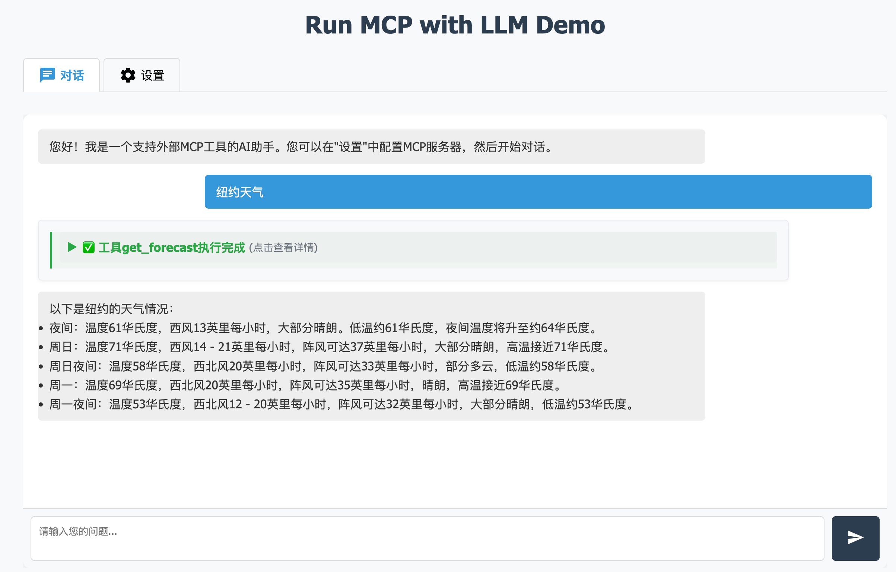
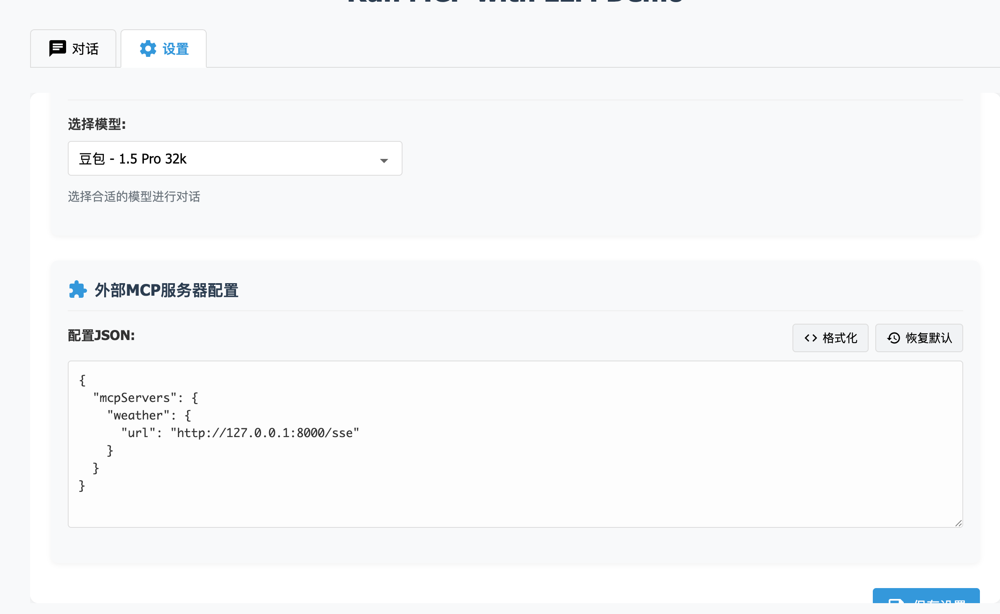

# Run MCP with LLM Demo

<div align="center">
  
  <br>
  <p><strong>将大语言模型与外部MCP服务器无缝集成的演示应用</strong></p>
</div>

## 🚨 最新更新

**2024年5月更新：StreamableHttpTransport 连接问题修复**

我们修复了使用 StreamableHttpTransport 连接 MCP 服务器时可能出现的 400 Bad Request 错误问题。此问题主要由 StreamableHttpTransport 和 SSETransport 的 URL 格式要求差异导致。现已改进：

- 增强了 `mcp_service.py` 中的传输对象创建逻辑，提供更完善的错误处理和日志记录
- 更新了 README 中关于不同传输类型的配置说明和注意事项
- 改进了 `test_streamable.py` 测试脚本，使其成为诊断传输连接问题的有用工具

如果您仍然遇到连接问题，请查看[传输类型兼容性注意事项](#传输类型兼容性注意事项)部分，或运行测试脚本进行诊断。

## 📖 项目简介

这是一个展示如何将大语言模型与外部MCP（Model Control Protocol）服务器集成的Web应用。通过这个演示项目，您可以了解如何让大模型使用外部工具执行各种任务，例如查询天气、搜索信息或访问其他API服务。

## 💻 运行示例

<div align="center">
  
  <p><em>应用运行界面 - 天气查询示例</em></p>
</div>

<div align="center">
  
  <p><em>应用设置界面 - 天气查询示例</em></p>
</div>

## ✨ 特性

- 🤖 **大模型集成**：使用标准API与大语言模型进行对话交互
- 🔌 **MCP服务器连接**：支持通过HTTP和命令行两种方式连接外部MCP服务器
- 🔄 **流式响应**：实时显示模型回复，提供更好的用户体验
- 🛠️ **工具调用**：支持大模型调用外部工具并处理工具执行结果
- 📱 **现代化UI**：直观友好的用户界面，支持移动设备

## 🚀 快速开始

### 前置条件

- Python 3.8+
- [FastMCP](https://github.com/fastmcp/fastmcp) 库
- 有效的API密钥（目前支持豆包等中文大模型）

### 安装依赖

```bash
pip install -r requirements.txt
```

### 启动MCP服务（重要）

在使用本应用前，您需要先启动至少一个MCP服务。本项目支持三种MCP服务连接模式：

#### 1. SSE模式（基于HTTP的服务器发送事件）

这是一种基于HTTP的连接方式，服务器通过SSE（Server-Sent Events）向客户端推送消息。

```bash
# 启动示例气象服务（SSE模式）
bash run_weather_service.sh
```

#### 2. Streamable HTTP模式

这是另一种基于HTTP的连接方式，使用流式HTTP响应传输数据，适用于某些不支持SSE的环境。

```bash
# 启动支持Streamable的服务（示例）
python run_streamable_service.py
```

在配置中指定 `transport_type` 为 `streamable-http`：

```json
{
  "url": "http://localhost:8001/stream",
  "transport_type": "streamable-http"
}
```

#### 3. Stdio模式（基于标准输入输出的命令行交互）

这种模式通过标准输入/输出与工具进行通信，支持以下两种方式启动：

**使用UVX（UnoVis执行器）**：
```bash
# 安装UVX
npm install -g @unovis/exec

# 启动工具服务（示例）
uvx your-tool-script.js
```

**使用NPX**：
```bash
# 启动工具服务（示例）
npx your-npm-package [参数]
```

> **注意**：无论使用哪种模式，都需要确保MCP服务已经启动并正常运行，然后才能在Web界面中配置连接。

### 设置环境变量

```bash
# Linux/MacOS
export ARK_API_KEY=your_api_key_here

# Windows (PowerShell)
$env:ARK_API_KEY = "your_api_key_here"

# 或者在启动时直接传递
python run.py --api-key=your_api_key_here
```

### 启动应用

```bash
python run.py
```

应用将在 http://localhost:8080 上运行。在浏览器中打开此地址即可使用。

## ⚙️ 配置外部MCP服务器

在Web界面的"设置"标签页中，您可以配置外部MCP服务器。配置采用JSON格式：

```json
{
  "mcpServers": {
    "weather": {
      "url": "http://127.0.0.1:8000/sse",
      "transport_type": "sse"
    },
    "streamable_server": {
      "url": "http://127.0.0.1:8001/stream",
      "transport_type": "streamable-http"
    },
    "command_server": {
      "command": "./run_tool.sh",
      "args": ["--arg1", "--arg2"],
      "env": {
        "ENV_VAR1": "value1"
      }
    }
  }
}
```

### 支持的服务器类型

- **HTTP服务器**：通过URL连接，支持两种传输类型：
  - **SSE模式**（默认）：使用服务器发送事件传输
    ```json
    {
      "url": "http://127.0.0.1:8000/sse",
      "transport_type": "sse"  // 可选，默认为 sse
    }
    ```
  
  - **Streamable HTTP模式**：使用流式HTTP传输
    ```json
    {
      "url": "http://127.0.0.1:8001/stream",
      "transport_type": "streamable-http"
    }
    ```
    
    **重要说明**：Streamable HTTP模式与SSE模式的URL格式要求不同：
    - Streamable HTTP模式通常需要完整的URL路径，包括查询参数（如果需要）
    - 某些服务器（如Smithery.ai）使用特定的URL格式：`https://server.smithery.ai/@username/fetch/mcp?api_key=your_key`
    - 确保服务器端支持Streamable HTTP传输类型
    - 客户端和服务器必须使用相同的传输类型，不能混用

- **命令行服务器（Stdio模式）**：通过执行命令启动，支持UVX和NPX
  ```json
  {
    "command": "./run_tool.sh",
    "args": ["--arg1", "--arg2"], 
    "env": {
      "ENV_VAR1": "value1"
    }
  }
  ```

  **UVX示例**：
  ```json
  {
    "command": "uvx",
    "args": ["your-tool-script.js"]
  }
  ```

  **NPX示例**：
  ```json
  {
    "command": "npx",
    "args": ["your-npm-package", "--param1", "value1"]
  }
  ```

### 传输类型兼容性注意事项

1. **服务器和客户端必须使用匹配的传输类型**：
   - 如果服务器使用SSE，客户端必须配置`transport_type: "sse"`
   - 如果服务器使用Streamable HTTP，客户端必须配置`transport_type: "streamable-http"`

2. **URL格式差异**：
   - SSE传输通常使用`/sse`路径
   - Streamable HTTP可能使用`/stream`或其他自定义路径
   - 某些第三方服务（如Smithery.ai）有特定的URL格式要求

3. **调试问题**：
   - 如果遇到400错误，请检查URL格式和传输类型是否匹配
   - 使用`test_streamable.py`脚本测试连接
   - 查看日志输出，了解具体错误信息

## 🌤️ 示例气象服务

项目附带了一个示例气象服务，用于演示外部MCP服务器的使用：

```bash
# 启动气象服务
bash run_weather_service.sh
```

启动后，您可以在Web界面中配置以下内容来连接：

```json
{
  "mcpServers": {
    "weather": {
      "url": "http://127.0.0.1:8000/sse",
      "transport_type": "sse"  // 默认使用SSE传输类型
    }
  }
}
```

然后，您可以在聊天界面中询问天气，例如：
- "北京今天天气怎么样？"
- "上海明天会下雨吗？"
- "武汉气温多少度？"

## 🧩 项目结构

```
.
├── app/                  # 主应用代码
│   ├── api/              # API路由和端点
│   │   └── routes.py     # API路由定义
│   ├── services/         # 服务层
│   │   └── mcp_service.py # MCP服务集成
│   ├── static/           # 静态资源
│   │   ├── css/          # 样式文件
│   │   └── js/           # JavaScript代码
│   ├── templates/        # HTML模板
│   └── main.py           # 应用主模块
├── fastmcp/              # FastMCP库（子模块）
├── requirements.txt      # 项目依赖
├── run.py                # 主运行脚本
├── run_weather_service.sh # 气象服务启动脚本
└── weather_service.py    # 示例气象服务
```

## 📚 技术栈

- **后端**：FastAPI, Python 3.8+
- **前端**：HTML, CSS, JavaScript
- **工具集成**：FastMCP 库
- **模型接口**：兼容 OpenAI API 的接口

## 🔍 开发说明

### 添加新工具服务器

1. 创建一个遵循MCP协议的服务器脚本
2. 确保服务器提供所需的工具定义和实现
3. 将服务器配置添加到Web界面中的MCP配置

### 自定义界面

前端界面使用简单的HTML、CSS和JavaScript实现。您可以通过修改`app/templates`和`app/static`目录中的文件来自定义界面。

## 📋 待办功能

- [ ] 支持更多大模型提供商
- [ ] 添加更多示例工具服务
- [ ] 用户认证和配置保存
- [ ] Docker容器化部署

## 📝 许可

本项目采用 [MIT 许可证](LICENSE)。

## 🙏 致谢

- [FastMCP](https://github.com/fastmcp/fastmcp) - MCP协议实现
- 所有贡献者和测试用户

---

<div align="center">
  <p>Made with ❤️ for the AI and MCP community</p>
</div> 